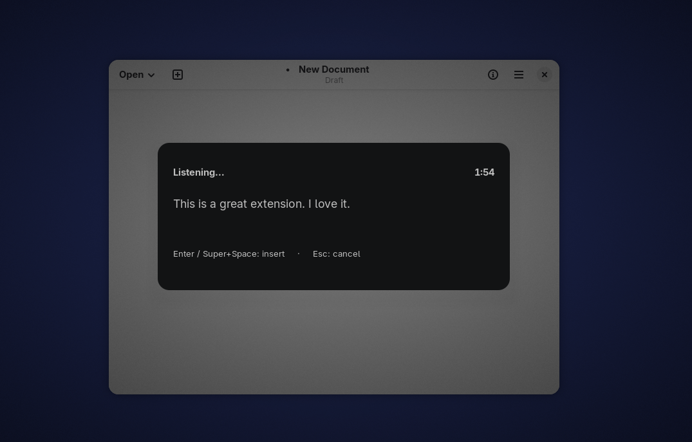

<h1>
  
  &nbsp;Murmur
</h1>

Push-to-talk voice dictation for GNOME. A centered overlay records your speech, streams it to [Mistral Voxtral](https://mistral.ai) for realtime transcription, and inserts the result into the focused field.



## Contents

- [Features](#features)
- [Requirements](#requirements)
- [Install](#install)
- [Configuration](#configuration)
- [How it works](#how-it-works)
- [Text insertion](#text-insertion)
- [Development](#development)

## Features

- Push-to-talk: one shortcut to start, the same shortcut (or `Enter`) to stop and insert.
- Live transcription in a centered overlay with a countdown.
- Realtime streaming to Mistral Voxtral over a WebSocket.
- Self-contained: pure JavaScript, no build step.
- Types via [dotool](#text-insertion) for full Unicode in any app including terminals, with a virtual-keyboard fallback.

## Requirements

- **GNOME Shell 47-50** on a Wayland session.
- **PipeWire `pw-record`** - captures the microphone; ships with PipeWire, standard on modern GNOME. Murmur notifies you if it is missing.
- **[dotool](https://sr.ht/~geb/dotool/)** (recommended) - types arbitrary Unicode into any app, including terminals. Needs access to `/dev/uinput` (typically the `input` group plus dotool's udev rule). Without it, Murmur falls back to the virtual keyboard, which can only type characters from your current keyboard layout. See [Text insertion](#text-insertion).

## Install

### From extensions.gnome.org (recommended)

Install Murmur from its [page on extensions.gnome.org](https://extensions.gnome.org/extension/10343/murmur/).

### Manual

```bash
git clone https://github.com/roman-16/murmur.git
cd murmur
just install   # symlinks into ~/.local/share/gnome-shell/extensions and compiles the schema
```

On Wayland, log out and back in so GNOME Shell picks up the extension, then enable it (the *Extensions* app, or `gnome-extensions enable murmur@roman-16.github.io`).

## Configuration

Open Murmur's preferences (*Extensions* app, or `gnome-extensions prefs murmur@roman-16.github.io`):

- **Mistral API key** - your key for the Mistral Voxtral endpoint.
- **Recording shortcut** - defaults to `Super+Space`.

## How it works

1. Press the shortcut. A centered overlay opens and starts recording.
2. Audio streams to Mistral Voxtral; partial transcriptions appear live.
3. Press `Enter` or the shortcut again to stop. The microphone is released, the final transcription is collected, the overlay closes, and the text is inserted into the previously focused field.
4. `Esc` cancels without inserting.

## Text insertion

Murmur inserts text with the best available method, decided at runtime:

- **dotool (recommended).** If [`dotool`](https://sr.ht/~geb/dotool/) is installed and reachable, Murmur uses it to type arbitrary Unicode into any application, including terminals. This is the recommended setup - see below.
- **Virtual keyboard (fallback).** Without dotool, Murmur types with a built-in virtual keyboard that can only produce characters from your **current keyboard layout**; characters not on your layout (emoji, other scripts, some punctuation) may be dropped.

To set up the recommended dotool path on any distribution:

1. Install `dotool`.
2. Grant your user access to `/dev/uinput` (dotool ships a udev rule; typically this means adding yourself to the `input` group).
3. Optionally run the `dotoold` daemon for faster typing.

## Development

Copy `.env.example` to `.env` and set `MISTRAL_API_KEY` (and optionally `RECORDING_SHORTCUT`).

The toolchain is pinned with [devbox](https://www.jetify.com/devbox):

```bash
devbox shell        # or: direnv allow
just lint           # oxlint (quality gate)
just dev            # run in a throwaway, isolated nested GNOME Shell
just install        # symlink into your real extensions dir (log out/in on Wayland)
just prefs          # open the preferences dialog (after the shell knows it)
just pack           # build a .shell-extension.zip
```
