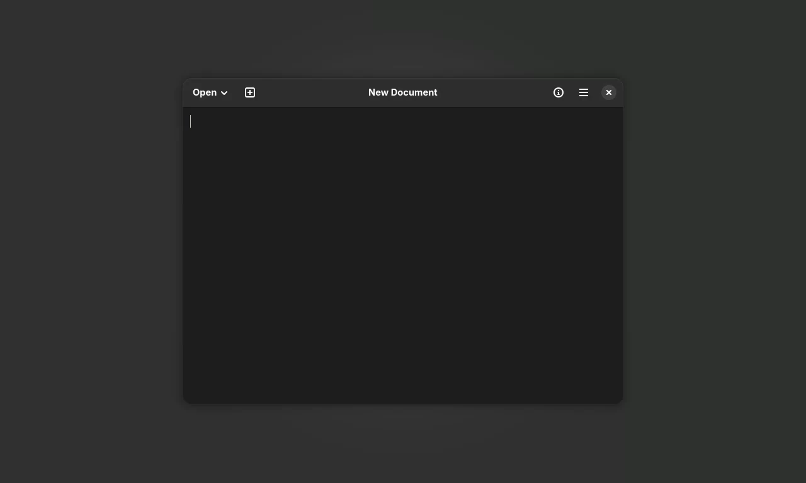

<div align="center">


# Murmur

**Speak into any text field in GNOME.**

[](https://github.com/roman-16/murmur/releases/latest) [](docs/installation.md) [](docs/installation.md) [](LICENSE)



</div>
<br />

Press `Super+Space`, say what you mean, and the words appear where your cursor already is: in a browser, an editor, a chat box or a terminal. No window to switch to, no daemon in the background, and nothing to paste afterwards.

- **It lands where you are looking.** Where there is a field, the transcription is typed into it, in any application, terminals included, with nothing pasted and your clipboard untouched.
- **You watch it happen.** Audio streams to [Mistral Voxtral](https://mistral.ai) over a WebSocket while you speak, and the text appears in the overlay as it arrives, with a countdown and an optional hands-free stop after silence.
- **Nothing is ever lost.** If no text field is focused, Murmur says so before you speak and copies the transcription to the clipboard instead of firing a sentence worth of keystrokes at whatever happens to be in front.

## Install

```bash
curl -fLo /tmp/murmur.zip https://github.com/roman-16/murmur/releases/latest/download/murmur@roman-16.github.io.shell-extension.zip && gnome-extensions install -f /tmp/murmur.zip && rm /tmp/murmur.zip
```

Then log out and back in, which Wayland requires for a new extension, and enable it:

```bash
gnome-extensions enable murmur@roman-16.github.io
```

You need **GNOME Shell 47 to 50 on Wayland**, **`pw-record`** from PipeWire, and a **Mistral API key**. Installing with Nix, from source, from extensions.gnome.org once the listing is approved, updating and uninstalling: → [Installation](docs/installation.md)

## Get started

Open the preferences and paste in your key from [console.mistral.ai](https://console.mistral.ai):

```bash
gnome-extensions prefs murmur@roman-16.github.io
```

That is the whole setup. Put the cursor where the words belong, press `Super+Space`, and speak.

| Key | What it does |
| --- | --- |
| `Super+Space` | Start recording, and stop it the same way `Enter` does |
| `Enter` | Stop and deliver the transcription |
| `Ctrl+Enter` | Stop and copy to the clipboard |
| `Esc` | Cancel, insert nothing, copy nothing |

→ [Getting started](docs/getting-started.md)

## Where your text goes

Murmur checks whether anything can actually receive text **before** it starts recording, and the overlay says so for the whole recording, so the destination is never a surprise at the end.

| What Murmur sees | What it does |
| --- | --- |
| An application with a focused field | Types the transcription into it with [dotool](docs/text-insertion.md#dotool), or the shell's virtual keyboard when dotool is unavailable |
| Nothing that can take text | Copies it to the clipboard and says so, rather than turning your sentence into keyboard shortcuts |

The overlay says which it will be for the whole recording, so it is never a surprise at the end. `Ctrl+Enter` copies instead, whatever it says, for when the words belong somewhere other than the field in front of you.

Want to know whether an application is recognised? Turn on GNOME's on-screen keyboard and click into the field. If it pops up, Murmur sees that field too, because both read the same signal. → [Where the text goes](docs/text-insertion.md)

## What leaves your machine

Your voice, to `api.mistral.ai`, while you are recording. That is the only connection Murmur makes: no telemetry, no analytics, no update pings.

The transcription is never written to disk and the audio never touches it either. Your API key is stored in dconf like every other GNOME setting, which means unencrypted, because extensions have no keyring access. If a dictation must not reach a third party, Murmur is the wrong tool. → [Privacy](docs/privacy.md)

## Documentation

| Page | What's in it |
| --- | --- |
| [Installation](docs/installation.md) | Every install route, requirements, updating, uninstalling |
| [Getting started](docs/getting-started.md) | Your API key, your first dictation, the four keys |
| [Configuration](docs/configuration.md) | Every setting, what it changes, and its `gsettings` key |
| [Where the text goes](docs/text-insertion.md) | The insertion ladder, which apps are recognised, dotool setup |
| [Troubleshooting](docs/troubleshooting.md) | Symptom, cause, fix |
| [How it works](docs/how-it-works.md) | Shortcut to text, step by step, and what runs where |
| [Privacy](docs/privacy.md) | What leaves your machine, what is stored, what it costs |
| [Limitations](docs/limitations.md) | What Murmur will not do, and why |

## Good to know

- **A terminal is one big text field.** It tells the compositor it accepts text whenever it is focused and nothing finer, so Murmur will happily deliver a sentence to vim in normal mode.
- **Dictation is billed to your key.** Murmur sends only what it records, and the two-minute cap keeps a forgotten recording from running away.
- **Wayland only.** XWayland applications inside a Wayland session are fine; an X11 session is not.
- **dotool is recommended.** Without it the fallback keyboard can only produce characters from your current layout, so emoji and other scripts are dropped.
- **Passwords are typed, never copied.** A password field is still a text field, so nothing lands on the clipboard.

## Contributing

Issues, ideas and pull requests are welcome. [`CONTRIBUTING.md`](CONTRIBUTING.md) has the setup and the everyday commands, [`CHANGELOG.md`](CHANGELOG.md) records what each version changed, and [`SECURITY.md`](SECURITY.md) has the private channel for security reports.

## License

[MIT](LICENSE)
