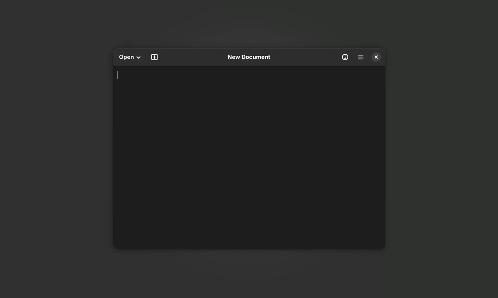

<div align="center">


# Murmur

**Speak into any text field in GNOME, or record everything you hear and say.**

[](https://github.com/roman-16/murmur/releases/latest) [](docs/installation.md) [](docs/installation.md) [](LICENSE)



</div>
<br />

Press `Super+Space`, say what you mean, and the words appear where your cursor already is: in a browser, an editor, a chat box or a terminal. No window to switch to, no daemon in the background, and nothing to paste afterwards.

Press `Super+Alt+Space` instead and Murmur records everything your computer plays and your microphone hears - a call in Teams, Meet or Discord, a video, anything - until you press it again. Then it transcribes the lot, and the audio and the transcript sit side by side in `~/Documents/Murmur`.

- **You keep working while it listens.** A panel the size of a notification appears at the bottom of the screen you are working on; it takes nothing over. Look anywhere else - another window, the overview, the window you were already in - and it collapses by itself, leaving an indicator with the countdown in the top bar. It is on screen exactly while it has your keyboard, so it is never in the way and never swallowing keys.
- **It lands where you are looking.** Where there is a field, the transcription is typed into it, in any application, terminals included, with nothing pasted and your clipboard untouched. Which field is decided when you stop, so you can go and find it while you talk.
- **You watch it happen.** A level that moves with your voice, a countdown, the destination named the whole time, and an optional hands-free stop after silence. With [Grok](https://docs.x.ai/developers/model-capabilities/audio/speech-to-text) or [Mistral Voxtral](https://mistral.ai) your audio streams over a WebSocket as you speak and the words appear in the panel as they arrive; with [OpenRouter](https://openrouter.ai/models?output_modalities=transcription) the dictation goes up when you stop and every transcription model it serves is one key away.
- **Nothing is ever lost.** If no text field is focused when you stop, Murmur copies the transcription to the clipboard instead of firing a sentence worth of keystrokes at whatever happens to be in front.
- **You can go back to what you said.** Every dictation is kept on your machine and listed in the preferences, newest first: click one to copy it, search them, or clear the lot. A field the application reports as a password is never kept.
- **A recording stays out of the way for hours.** It lives in the top bar alone, as a pill with how long it has run; its menu shows what the microphone and the desktop are hearing, and stops or discards it. It carries on while the screen is locked. When you stop it, a notification opens the transcript or copies it, and a recording that could not be transcribed keeps its audio and asks again.

## Install

```bash
curl -fLo /tmp/murmur.zip https://github.com/roman-16/murmur/releases/latest/download/murmur@roman-16.github.io.shell-extension.zip && gnome-extensions install -f /tmp/murmur.zip && rm /tmp/murmur.zip
```

Then log out and back in, which Wayland requires for a new extension, and enable it:

```bash
gnome-extensions enable murmur@roman-16.github.io
```

You need **GNOME Shell 47 to 50 on Wayland**, **GStreamer** with its base and good plugins and PipeWire's GStreamer plugin, which GNOME's own screen recorder needs anyway, and an **API key** for one of the three transcription services. Installing with Nix, from source, from extensions.gnome.org once the listing is approved, updating and uninstalling: → [Installation](docs/installation.md)

## Get started

Open the preferences, choose the service that transcribes for you, and paste in its key:

```bash
gnome-extensions prefs murmur@roman-16.github.io
```

| Service | Key from | What it costs |
| --- | --- | --- |
| **Grok** | [console.x.ai](https://console.x.ai), once the account holds credit | Dictation about $0.20 an hour of audio, recording about $0.10 an hour. The words appear as you speak, a dictation runs as long as you set, and a recording as long as you like |
| **Mistral Voxtral** (default) | [console.mistral.ai](https://console.mistral.ai) | Dictation about $0.36 an hour, recording about $0.18 an hour, from the first minute. A dictation runs as long as you set |
| **OpenRouter** | [openrouter.ai/settings/keys](https://openrouter.ai/settings/keys) | One key for every transcription model it serves - Whisper, Nova, Voxtral, Parakeet - at each one's own price. A dictation's words arrive when you stop rather than as you speak; a dictation runs ten minutes at most |

That is the whole setup. Put the cursor where the words belong, press `Super+Space`, and speak. Or press `Super+Alt+Space` to record.

| Key | What it does |
| --- | --- |
| `Super+Space` | Start a dictation, and stop it the same way `Enter` does. Works from anywhere, always |
| `Enter` | Stop and deliver the transcription |
| `Ctrl+Enter` | Stop and copy to the clipboard |
| `Esc` | Cancel, insert nothing, copy nothing |

`Enter`, `Ctrl+Enter` and `Esc` reach the panel while it is on screen, which is exactly while it holds the keyboard. Look anywhere else and both go at once: the keyboard is yours again and the panel collapses to the top bar. `Super+Space` is a system shortcut and works either way.

| Key | What it does |
| --- | --- |
| `Super+Alt+Space` | Start a recording of everything you hear and say, and stop it to have it transcribed. Click the pill in the top bar to watch the levels, stop it, or discard it |

→ [Getting started](docs/getting-started.md)

## Where your text goes

Murmur asks where the words go **at the moment you stop**, and the panel names the destination the whole time you are speaking, so it is never a surprise at the end.

| What Murmur sees when you stop | What it does |
| --- | --- |
| An application with a focused field | Types the transcription into it with [dotool](docs/text-insertion.md#dotool), or the shell's virtual keyboard when dotool is unavailable |
| Nothing that can take text | Copies it to the clipboard and says so, rather than turning your sentence into keyboard shortcuts |

Because the question is asked at the end, you can start talking anywhere and click into the right field while you speak. `Ctrl+Enter` copies instead, whatever the panel says, for when the words belong somewhere other than the field in front of you.

Want to know whether an application is recognised? Turn on GNOME's on-screen keyboard and click into the field. If it pops up, Murmur sees that field too, because both read the same signal. → [Where the text goes](docs/text-insertion.md)

## What leaves your machine

Your voice, and while recording everything your computer plays, to the service you picked - `api.mistral.ai` by default, or `api.x.ai` or `openrouter.ai` - over a dictation or recording you started. That is the only connection Murmur makes: no telemetry, no analytics, no update pings.

Dictation audio is never written to disk. The transcription is, on your machine only: the text of each dictation is kept in `~/.local/state/murmur@roman-16.github.io/history.jsonl` so you can read it back later, until you clear it or turn **Remember what I dictate** off. A recording is written to disk whole: its audio and its transcript are saved side by side in `~/Documents/Murmur`, readable by you alone, and stay there until you delete them. Your API key is stored in dconf like every other GNOME setting, which means unencrypted, because extensions have no keyring access. If what you say must not reach a third party, Murmur is the wrong tool. → [Privacy](docs/privacy.md)

## Documentation

| Page | What's in it |
| --- | --- |
| [Installation](docs/installation.md) | Every install route, requirements, updating, uninstalling |
| [Getting started](docs/getting-started.md) | Your API key, your first dictation, the keys, your first recording |
| [Configuration](docs/configuration.md) | Every setting, what it changes, and its `gsettings` key |
| [Where the text goes](docs/text-insertion.md) | The insertion ladder, which apps are recognised, dotool setup |
| [Troubleshooting](docs/troubleshooting.md) | Symptom, cause, fix |
| [How it works](docs/how-it-works.md) | Shortcut to text and shortcut to file, step by step, and what runs where |
| [Privacy](docs/privacy.md) | What leaves your machine, what is stored, what it costs |
| [Limitations](docs/limitations.md) | What Murmur will not do, and why |

## Good to know

- **A terminal is one big text field.** It tells the compositor it accepts text whenever it is focused and nothing finer, so Murmur will happily deliver a sentence to vim in normal mode.
- **Dictation and recording are billed to your key.** Murmur sends only what it records, and the ten-minute default keeps a forgotten dictation from running away. A recording runs until you stop it.
- **Tell people you are recording.** A recording holds everyone in the call, and their voices go to the service too.
- **A transcript is what the service sends back.** Murmur writes it to the file untouched, piece after piece for a long recording: no speaker names, no timestamps, no headings, only whatever the model produced.
- **OpenRouter cannot transcribe as you speak.** It has no streaming transcription API, so with it the panel shows the level and the countdown while you talk, and the words all arrive when you stop. What it gives instead is the choice: every transcription model it serves, behind one key.
- **A dictation always arrives as one line.** Line breaks are flattened to spaces before anything is typed, so a transcription can never press `Enter` in a chat box, a prompt or a shell. A tidied list keeps its bullets, inline.
- **The panel is not a window.** It cannot be alt-tabbed or pushed behind an application, because a GNOME Shell extension draws inside the compositor rather than opening a window. Clicking anything else collapses it to the top bar instead, which a window behind a maximised application could not do.
- **The panel shows the last four lines.** A long dictation scrolls past; the whole of it arrives in your field, and in the history, when you stop.
- **Wayland only.** XWayland applications inside a Wayland session are fine; an X11 session is not.
- **dotool is recommended.** Without it the fallback keyboard can only produce characters from your current layout, so emoji and other scripts are dropped.
- **Passwords are typed, never copied, never kept.** A password field is still a text field, so nothing lands on the clipboard or in the history - as long as the application reports the field as one, which XWayland applications cannot.

## Contributing

Issues, ideas and pull requests are welcome. [`CONTRIBUTING.md`](CONTRIBUTING.md) has the setup and the everyday commands, [`CHANGELOG.md`](CHANGELOG.md) records what each version changed, and [`SECURITY.md`](SECURITY.md) has the private channel for security reports.

## License

[MIT](LICENSE)
